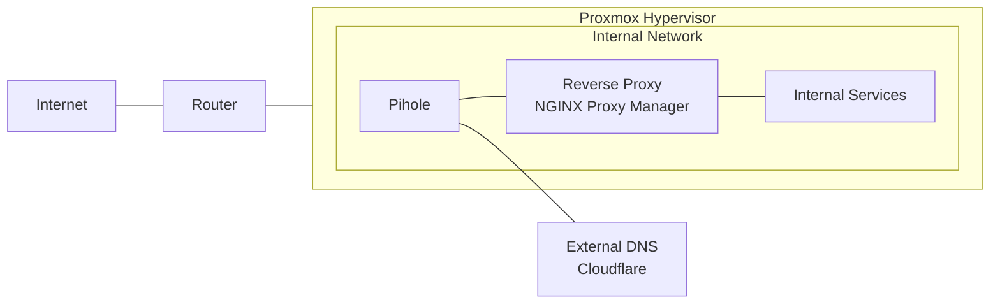

# My Homelab Infrastructure

## Overview
This repository documents my homelab setup, which I use for learning, testing, and running various self-hosted services. The lab provides hands-on experience with enterprise technologies and best practices in a controlled environment.

## Infrastructure

### Hardware
- Intel Hades Canyon NUC
  - CPU: Intel Core i7-8809G
  - RAM: 16GB
  - Storage: 250GB SSD

### Network Architecture

### Network Overview
- Network flows through Proxmox Hypervisor hosting:
  - Pi-hole for DNS management
     - Handles internal service resolution
     - Forwards external requests to Cloudflare
  - NGINX Proxy Manager
     - Routes traffic to internal services
     - Manages internal service access
  - Internal services running as VMs/containers

## Core Services

### Virtualization
- Proxmox VE
   - Type 1 hypervisor
   - Web-based management
   - Container & VM support
   - Primary host for all services

### DNS Management
- Pi-hole
   - Network-wide ad blocking
   - Internal DNS resolution
   - External DNS forwarding to Cloudflare
   - Custom domain management

### Reverse Proxy
- NGINX Proxy Manager
   - Internal service routing
   - Local domain management
   - Web interface for configuration

## Projects & Learning

### Current Projects
- [ ] Implementing centralized logging (ELK Stack)
- [ ] Setting up Kubernetes cluster
- [ ] Automated backup solution

### Completed Projects
- [x] Proxmox hypervisor implementation
- [x] DNS management with Pi-hole
- [x] Internal service routing via NGINX Proxy Manager

### Skills Demonstrated
- Virtualization (Proxmox VE)
- DNS Management and Configuration
- Reverse Proxy Implementation
- Network Architecture Design
- Linux System Administration
- Infrastructure Documentation

### Future Plans
- Implement monitoring and alerting
- Add more internal services
- Expand DNS capabilities

### Resources & Documentation
- [Proxmox VE Documentation](https://www.proxmox.com/en/proxmox-ve/documentation)
- [Pi-hole Documentation](https://docs.pi-hole.net/)
- [NGINX Proxy Manager Documentation](https://nginxproxymanager.com/guide/)

---
*Last Updated: October 2024*